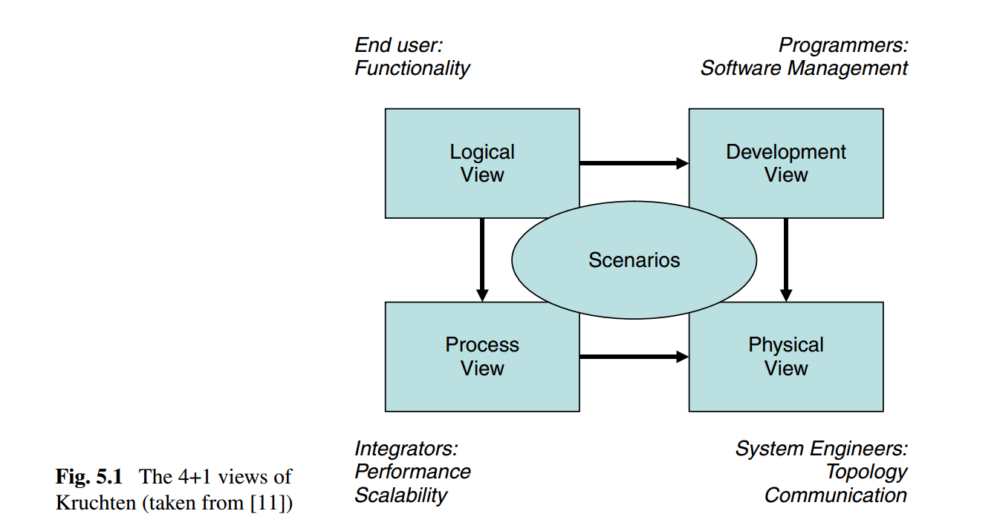
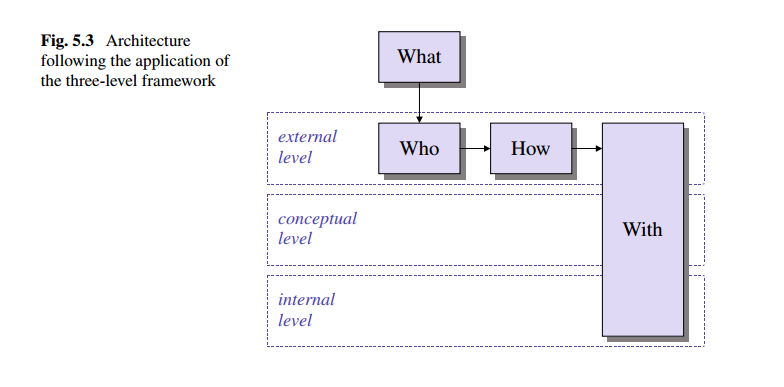
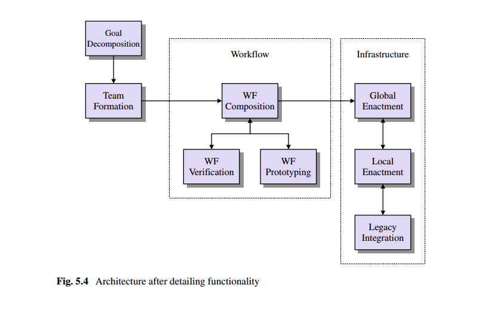

[TOC]
# 架构层
架构层介绍了支持组织结构的信息系统结构
## Introduction to Architecture
### What Is Architecture?
- `历史`: 在过去(十多年前)，信息系统复杂度是有限的，和其他信息系统交互的复杂度也有限，以前系统内业务功能简单，操作并不复杂，和其他系统的交互也比较简单，经常使用线下连接(比如，磁带作为传输媒介)。
- `现状`： 而现在，信息系统变得很复杂，支持很多扩展的业务功能。为了支持端到端(end-to-end)的业务流程，在组织内部或者边界上它们经常需要连接大量的各种各样的信息系统，这些信息系统形成信息系统网络(information system landscape)，融合在一起形成复杂的信息系统(an enteprise information system or even inter-enterprise information system)
- ` 架构概念的来源`: 为了设计复杂的信息系统应对当前系统中的变化，在信息系统领域出现了`architechture`的概念。一个信息系统的架构可以看做是该系统的上层的结构蓝图。软件系统架构概念源于软件工程(software engineering), 比如，该领域比较关注计算机程序的细节结构。
- 架构术语的基本定义:

  ```bash
  软件系统的体系结构根据计算组件(computational components)和这些组件之间的交互来定义系。
  ```
-  这里，我们关注的是复杂信息系统的结构。我们要求系统能够支持IVEs的建立和运行，这意味着我们不仅仅要看计算机程序的内部细节，更应该关注复杂系统更上层的结构。因此，我们必须分层看分析系统复杂度，以结构化的原则去理解系统的复杂度。对于架构概念一个扩展版本的定义:  
    ```
    (复杂的)信息系统的体系结构根据功能组件(functional components)和这些组件之间的交互来定义系统，从系统的特定方面的观点来看，可能被组织成多个级别，并且基于特定的结构原则
    ```

### Designing Architechtures
- `系统多面性`: 复杂的信息系统通常包括多个视图，从单一某个视图去把握理解整个系统很复杂也很困难，每个视图只体现该系统的某一面，因此，去设计一个架构，需要从各个视图角度去建模。
- 当前已经存在一些基于视图(view-based) 设计软件架构的方法。其中由Kruchten提出的`4+1`方法是一个比较好的标准方法。Kruchten提出了４种视图:
<center>

</center>

- `logical view`: 系统的抽象设计，设计主要包括系统模块，以及模块之间的交互；
- `process view`: 细化了关于技术平台的选择，比如，整合logical view中组件所用到的中间件等。
- `development view`: 描述了软件如何使用软件工程方法实现
- `physical view`: 构建与process view 和development view之上，描述了在分布式环境下如何部署模块。
- `scenarios`: 一些去用于开发和验证该设计方法的案例`industrial case studies `

### Systematic Requirements
基于`Dynamic Business Network Process Management (DBNPM)` 的描述, 为了使系统CrossWork方法提供自动化支持，我们可以从系统角度开始去描述所需功能。依据DBNPM/IVE系统上层的功能需求，我们归纳了以下系统需求:
- `RQ1`: 给定全局(IVE-level)业务目标`gg`，系统能够半自动化分解全局目标`gg`成多个局部(organizational-level)业务目标集`slg`；
- `RQ2`: 给定局部业务目标集`slg`,系统能够在业务市场中半自动化识别出组织集`so`, `so`中的组织一起应该能够(provide cappabities)通过实现`slg`中的每个局部目标从而完成全局目标`gg`;
- `RQ3`: 给定某个局部业务目标`lg`与某个组织`o`, 系统能够半自动化获得该组织`o`一个或多个外部级别(external level)的局部业务流程的规范,并且这些业务流程实现了该局部业务目标`lg`
<hr>

- `RQ4`: 给定局部业务流程集slp,系统能够半自动化组合`slp`中的局部业务流程成(IVE-level)业务网络流程(Business Network Process)/全局业务流程；
- `RQ5`: 给定某个业务网路流程`bnp`,系统可以不用将它发布到真实的IVE环境中运行即可验证`bnp`的运行时特征。
- `RQ6`: 给定某个业务网路流程`bnp`, 系统可以自动地将`bnp`y映射到IVE的DBNPM系统；
- `RQ7`: 给定某个已映射到DBNPM系统的业务网路流程`ds`的`bnp`, 系统可以自动地在`ds` 上运行`bnp`，运行时应该提供用户接口和监控接口。
- `RQ8`: 在业务网络流程`bnp`运行时，DBNPM系统能够保证`bnp`与运行`bnp`的组织的legacy systems的正常交互。
<hr>

- `RQ9`: 有些系统功能依赖于推理，而这些推理是以领域知识为基础。系统应该能够支持知识的积累和存储，支持推理机制访问知识库。

上面的需求多是半自动化的(simi-automatically), 在大多数场景中这些需求的完全自动化实现不是直接可行的，因为完全自动化需要完备的领域知识，而这些知识不能以机器翻译(machine-interpretable)格式获取。系统应该支持将知识从面向人工到面向机器的迁移能力。如此才能随着领域更形式化，自动化级别得到提升。这种迁移发生在业务市场生命周期内，通常跨域运行在市场内的许多IVE的生命周期，因此，提出了`RQ9`
这里全是功能需求，并未涉及非功能需求，非功能需求很重要，但是仅仅当我们处理系统实现细节的时候才回去关注它，它属于process view，而不属于logic view.

###  Logic view of the Architechture
以前面提到的系统需求为基础设计概念系统架构，上面的需求具有一定复杂度，因此需要一个清晰的设计方法才能设计出结构良好的架构。设计方法分为两阶段:
- `功能聚类`: 将不同功能进行分类聚合，作为设计架构的第一步；
- `逐步精细化`: 逐步精细化结构，划分模块
功能的分类聚类基于观点的抽象分离，关注点分离不是针对于该设计下的架构，而是一个概念工具，目的在于迈出架构设计的第一步。
#### Step 1: Defining High-Level Architectural Blocks
像`Zachman`关注点的分离可以通过基于询问的方式实现：
- `WHAT`: IVE的目标是什么？比如，要生产什么产品？？
- `WHO`: 哪些组织可以在一起形成IVE
- `HOW`: 通过哪个业务流程,IVE可以实现操作目标
- `WITH`: 有什么自动设施供业务流程运行;

`WITH`不是一个询问词，在这里意思相当于`HOW`，这里用来区分`HOW`是作为一个过程还是作为一种方式出现。
这四个询问词相当于`Zachman`中`WHAT`,`WHO`,`HOW`,`WHERE`。除此之外，`Zachman`还有`WHY`,`WHEN`。组建IVE的动机(比如，业务机会)可以看做是`WHY`,`WHEN`涉及直接在流程内处理，还是通过不同流程间同步来处理，这不属于架构设计部分。
<centter>

</center>

与询问词相关的功能聚类对应于IVE构建和运行中连续的四个阶段。连续的阶段决定了功能聚类可以被嵌入到`pipe and filter`架构模式中。上图，我们可以看到IVE的创建伴随`Goal Specificaiton`(由client organization给出的)输入开始，然后触发４个软件模块的pipeline.

 #### Step 2: Applying Architecture Levels
 步骤１中给出的架构，并没有区分层级，将所有模块放到同一级。我们采用`面向业务流程的跨组织协作`(inter-organizational process-oriented collaboration)的三层框架进行改造。该框架将业务流程的支持分为三个级别:`external`,`conceptual`,`internal`.　
 <centter>
 
 </center>

 - 中间的概念级别定义了业务流程的`logical process view`，　即不受局部技术设施或者外部(市场)需求的流程结构。
 - 外部级别包含需要外部化的业务流程概念级别到外部级别的投影，即在市场上需要对其他业务组织可见部分投影。因此外部级别与协作有关。
 - 内部级别指定了概念级别流程定义，使之适应局部技术设施(比如，局部企业信息系统)

 应用三层框架，将之前的架构转变为分层架构，但是`WITH`模块依旧跨越多层，因此为了实现完全的层次架构，需要继续细化功能，
 #### Step 3: Detailing Functionality
为了经一步细化架构，我们需要在必要的地方" 炸开"已经设计的模块。为了达到这个目的，我将系统需求和已有的功能聚类(模块)进行匹配，匹配关系如下表。
 <centter>
 
 </center>

 - `RQ9`是一个具体的功能切面，我们单独对待它，暂时不考虑它的细化，会在逻辑架构设计中重新考虑它。
 - 表中，`WHAT`与`WHO`都对应单个需求，因此不需要去扩展该级架构设计。而`HOW`和`WITH`则对应多个需求，因此需要去继续扩展他们；
 - `HOW`模块的功能是决定IVE的业务流程如何实现整体的业务目标(RQ3-RQ5)，这表明获取IVE成员的局部业务流程，并将它们编织到全局业务流程中，即组合多个局部工作流到全局工作流中；
 -  从架构的观点看，RQ3和RQ4对应的功能是编织，所以可以将他们合并成单个架构模块`Workflow Composition`;
 - RQ5对应的功能是对组合流程的静态验证和动态原型，从架构观点看，它们是两个分离的功能，因此应该放在连个单独的功能模块:`Workflow Verification` 与`Workflow Prototyping`;
 <centter>
 
 </center>

 - `WITH`模块的功能涉及组合得到的全局业务流程,同时考虑参与协作的IVE成员后台系统多是遗留系统的情况(RQ6-RQ8)，基于全局业务流程管理(IVE level跨组织同步)与局部业务流程管理(单个IVE成员内部)的区别，我们有必要在细节架构上扩展出`Global Enactment`与`Local Enactment`模块；
 - 考虑到DBNPM系统与后台系统的耦合，需要将复杂的功能交给单独的一个模块`Legacy Integration`，该模块的功能是为在多个异构的EISs上执行业务操作提供一个公共接口(common interfaces)
 - `Global Enactment`模块负责在业务边界上协调业务成员，应该把它放到外部级别，`Local Enactment`和`Legacy Integration`模块依赖与具体IVE成员的基础设施，应该把他们放到内部级别。
  - 我们没有将任何运行功能放在概念层，因为这需要在模块状态间双重动态映射，概念层是一个根据兴趣的可选项，本地业务流程的设计发生在概念层，接着在`Team Formation`阶段会将它映射到外部级别，在`Local Enactment`中会将她映射到内部级别。然而需要注意的是对该层设计的自动化支持不是我们方法要研究的范围，因为局部业务流程的设计不是针对DBNPM.因此在我们架构中忽略`Process Design`模块
#### Step 4: Adding Knowledge
